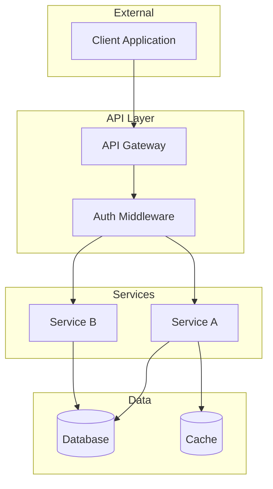
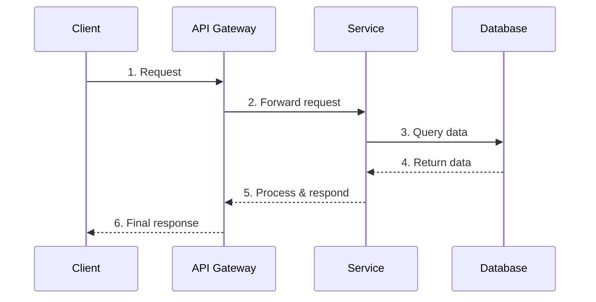

# Solution Design Template

> **Generated by:** Architect Agent  
> **Date:** [YYYY-MM-DD]  
> **Trace ID:** [Issue/Epic number]  
> **Source:** `docs/planning/business-context.md`  
> **Status:** Draft | Review | Approved

---

## Overview

[2-3 sentences describing the technical solution approach]

---

## Component Diagram

---

## Data Model

### New Entities

| Entity | Description | Primary Key |
|--------|-------------|-------------|
| [EntityName] | [Purpose] | [id type] |

### Entity Details

#### [EntityName]

| Field | Type | Constraints | Description |
|-------|------|-------------|-------------|
| id | UUID | PK, NOT NULL | Unique identifier |
| created_at | TIMESTAMP | NOT NULL | Creation timestamp |
| updated_at | TIMESTAMP | NOT NULL | Last update timestamp |
| [field] | [type] | [constraints] | [description] |

### Schema Changes

| Table | Change Type | Description |
|-------|-------------|-------------|
| [table_name] | ADD COLUMN | [column details] |
| [table_name] | CREATE INDEX | [index details] |

---

## Data Flow

### [Flow Name] (e.g., User Login)

**Steps:**
1. [Describe step 1]
2. [Describe step 2]
3. [Describe step 3]

---

## Security Considerations

### Authentication
- [ ] [Auth mechanism - e.g., JWT with 15-minute expiry]
- [ ] [Token refresh strategy]

### Authorization
- [ ] [Role-based access control details]
- [ ] [Resource-level permissions]

### Data Protection
- [ ] [Encryption at rest]
- [ ] [Encryption in transit]
- [ ] [PII handling]

### Input Validation
- [ ] [Validation approach - e.g., Zod schemas]
- [ ] [Sanitization requirements]

---

## Technical Constraints

### Performance
| Metric | Requirement | Measurement |
|--------|-------------|-------------|
| Response time | < [X] ms | P95 latency |
| Throughput | [X] req/sec | Peak load |

### Scalability
- Horizontal scaling: [Yes/No - details]
- Database sharding: [Yes/No - details]

### Availability
- Target uptime: [X]%
- Failover strategy: [Details]

---

## Integration Points

### APIs Consumed

| Service | Endpoint | Purpose | Auth |
|---------|----------|---------|------|
| [Service] | [URL/path] | [Purpose] | [Auth type] |

### APIs Exposed

| Endpoint | Method | Purpose | Consumers |
|----------|--------|---------|-----------|
| [path] | [GET/POST/etc] | [Purpose] | [Who uses it] |

### Events Published

| Event | Channel | Consumers |
|-------|---------|-----------|
| [EventName] | [channel.name] | [Services] |

### Events Consumed

| Event | Channel | Action |
|-------|---------|--------|
| [EventName] | [channel.name] | [What happens] |

---

## Architecture Decision Records

| ADR | Decision | Rationale |
|-----|----------|-----------|
| ADR-001 | [Decision made] | [Why this choice] |

---

## Risks & Mitigations

| Risk | Probability | Impact | Mitigation |
|------|-------------|--------|------------|
| [Risk description] | Low/Med/High | Low/Med/High | [Mitigation strategy] |

---

## Approval

| Role | Name | Date | Signature |
|------|------|------|-----------|
| Tech Lead | | | |
| Security | | | |

---

## Changelog

| Version | Date | Author | Changes |
|---------|------|--------|---------|
| 1.0 | [Date] | [Name] | Initial design |
