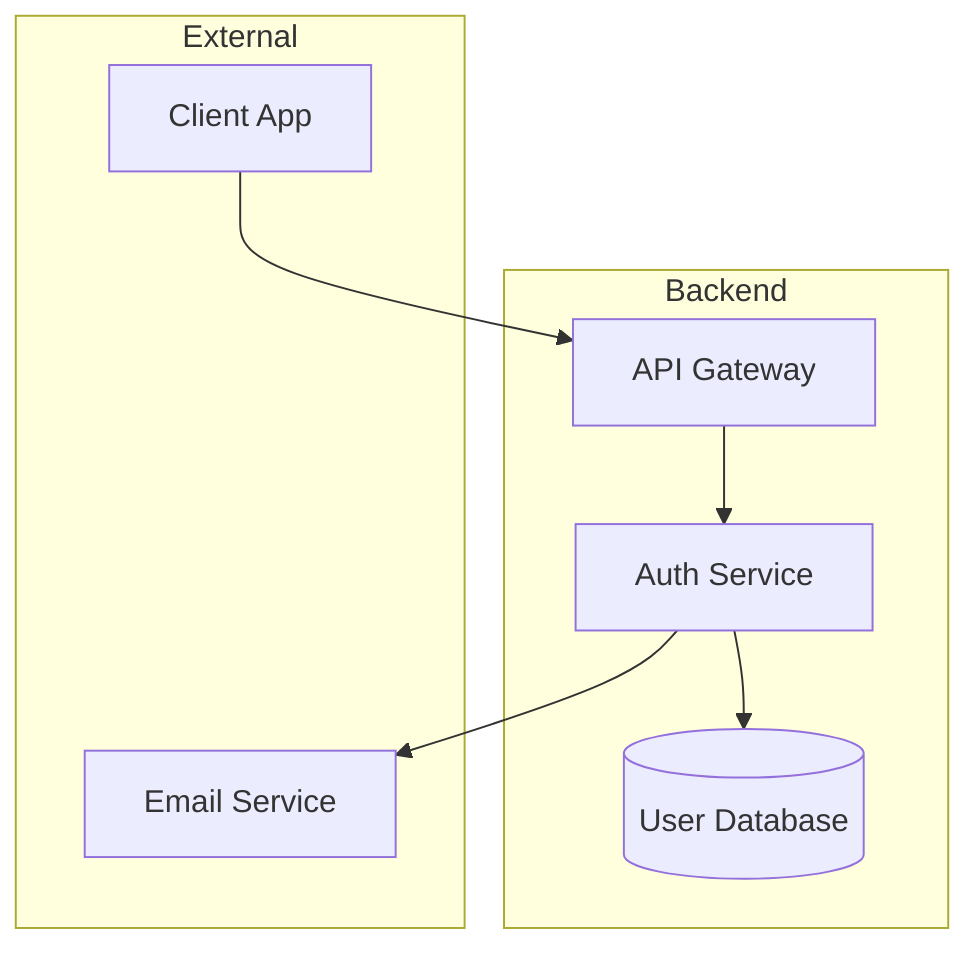

# Architecture Validation Checklist

> **Book Reference:** Appendix C — "Best Practices Checklists"
> 
> **When to Use:** After Architect completes, before handing off to API Champion

## Purpose

Validate that the Architect agent has produced a complete `solution-design.md` artifact that provides a solid technical foundation for API and messaging contracts.

---

## Checklist

### 1. Artifact Exists

- [ ] File `docs/planning/solution-design.md` exists
- [ ] File is not empty (minimum 100 lines)
- [ ] Input artifact `docs/planning/business-context.md` was consumed

```bash
# Verification commands
test -f docs/planning/solution-design.md && \
  wc -l docs/planning/solution-design.md | awk '$1 >= 100'
```

---

### 2. Component Diagram

- [ ] Mermaid.js diagram present and valid
- [ ] All system components labeled
- [ ] Component interactions shown with arrows
- [ ] External systems marked as such

**Expected Format:**


**Validation:**
```bash
# Check for Mermaid diagram
grep -q "```mermaid" docs/planning/solution-design.md
```

---

### 3. Data Model

- [ ] Schema changes documented
- [ ] New entities defined with fields
- [ ] Field types specified
- [ ] Relationships documented (1:N, N:M)
- [ ] Migration strategy mentioned (if modifying existing)

**Expected Format:**
```
### New Entity: PasswordResetToken

| Field | Type | Constraints |
|-------|------|-------------|
| id | UUID | PK |
| user_id | UUID | FK → users.id |
| token | string(64) | unique, indexed |
| expires_at | timestamp | not null |
| used_at | timestamp | nullable |
```

---

### 4. Data Flow

- [ ] Step-by-step data movement documented
- [ ] Numbered sequence of operations
- [ ] Input/output for each step
- [ ] Error paths included

**Expected Format:**
```
### Password Reset Flow

1. User submits email → API receives request
2. API validates email format → Pass/Fail
3. Auth Service looks up user → User found/not found
4. Auth Service generates token → Token stored in DB
5. Email Service sends reset link → Email queued
6. User clicks link → Token validated
7. User submits new password → Password updated
```

---

### 5. Security Considerations

- [ ] Authentication requirements documented
- [ ] Authorization model specified
- [ ] Data protection measures listed
- [ ] Sensitive data handling noted

**Must Address:**
- [ ] How is the user authenticated?
- [ ] What data needs encryption at rest?
- [ ] What data needs encryption in transit?
- [ ] Rate limiting requirements?
- [ ] Audit logging requirements?

---

### 6. Technical Constraints

- [ ] Performance requirements stated
- [ ] Scalability considerations documented
- [ ] Availability requirements noted
- [ ] Known limitations listed

**Example:**
```
### Performance Requirements
- Token generation: < 100ms
- Email sending: < 5 seconds
- Token validation: < 50ms

### Scalability
- Must support 1000 concurrent reset requests
- Token storage: ~100K active tokens

### Limitations
- Single region deployment (Phase 1)
- No offline support
```

---

### 7. Integration Points

- [ ] All APIs listed (internal and external)
- [ ] Database connections documented
- [ ] Third-party services identified
- [ ] Message queues/events listed

**Expected Format:**
```
### Integration Points

| System | Type | Protocol | Notes |
|--------|------|----------|-------|
| User Service | Internal API | REST | User lookup |
| Email Service | External API | REST | SendGrid |
| PostgreSQL | Database | SQL | Token storage |
| Redis | Cache | Redis Protocol | Rate limiting |
```

---

### 8. Requirements Traceability

- [ ] References business-context.md
- [ ] Each component maps to user stories
- [ ] Acceptance criteria coverage noted

**Example:**
```
### Traceability Matrix

| Component | User Stories | Acceptance Criteria |
|-----------|--------------|---------------------|
| Token Service | US-001, US-002 | AC-001, AC-002, AC-003 |
| Email Integration | US-003 | AC-004, AC-005 |
```

---

### 9. Architectural Fit

- [ ] Follows existing system patterns
- [ ] No new technologies without justification
- [ ] Consistent with current stack
- [ ] If new patterns proposed, ADR created

**Questions to Answer:**
- Does this fit our existing architecture?
- Are we introducing new patterns? Why?
- Is the complexity justified by requirements?

---

### 10. Human Validation

- [ ] Architecture reviewed with tech lead
- [ ] Security considerations approved
- [ ] Performance targets agreed
- [ ] Sign-off obtained

---

## Summary Score

| Category | Status | Notes |
|----------|--------|-------|
| Artifact exists | ☐ | |
| Component diagram | ☐ | |
| Data model | ☐ | |
| Data flow | ☐ | |
| Security | ☐ | |
| Technical constraints | ☐ | |
| Integration points | ☐ | |
| Traceability | ☐ | |
| Architectural fit | ☐ | |
| Human validation | ☐ | |

**Minimum to proceed:** 8/10 items passed

---

## Actions if Failed

### Missing Input
```
Cannot proceed: business-context.md not consumed.
Architect must read requirements before designing.
Return to Architect with:
- Path to business-context.md
- Instruction to read requirements first
```

### Missing Diagram
```
Component diagram required for API Champion.
Return to Architect with:
- Request for Mermaid.js diagram
- Example format provided
```

### Security Gaps
```
Security considerations incomplete.
Before API Champion handoff:
1. Complete security section
2. Review with security team
3. Document approved mitigations
```

---

## Automation Script

```bash
#!/bin/bash
# validate-architecture.sh

FILE="docs/planning/solution-design.md"
INPUT="docs/planning/business-context.md"

echo "=== Architecture Checklist Validation ==="

# Check input was consumed (referenced)
if ! grep -q "business-context" "$FILE" 2>/dev/null; then
    echo "⚠️ WARNING: No reference to business-context.md"
fi

# Check file exists
if [ ! -f "$FILE" ]; then
    echo "❌ FAIL: $FILE does not exist"
    exit 1
fi
echo "✅ File exists"

# Check minimum length
LINES=$(wc -l < "$FILE")
if [ "$LINES" -lt 100 ]; then
    echo "❌ FAIL: File has $LINES lines (minimum 100)"
    exit 1
fi
echo "✅ File has $LINES lines"

# Check for Mermaid diagram
if grep -q '```mermaid' "$FILE"; then
    echo "✅ Mermaid diagram found"
else
    echo "❌ FAIL: No Mermaid diagram found"
fi

# Check for required sections
for section in "Data Model" "Data Flow" "Security" "Integration"; do
    if grep -qi "$section" "$FILE"; then
        echo "✅ Section found: $section"
    else
        echo "⚠️ WARNING: Section missing: $section"
    fi
done

echo "=== Validation Complete ==="
```

---

## Mermaid Diagram Validation

Test your Mermaid diagrams at: https://mermaid.live/

**Common Issues:**
- Missing subgraph closing
- Invalid arrow syntax (`-->` not `->`)
- Unescaped special characters
- Missing node definitions

---

*Based on "Non-Deterministic Software Engineering" (2025), Appendix C — Architect produces the technical blueprint for implementation.*
